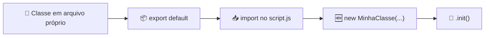

# 🏗️ Classes em JavaScript — Código Modular e Reutilizável

## 📌 O que é uma Classe?

Imagine que você precisa criar uma **navegação por abas (tabs)** no seu site. Sem classes, você escreveria todo o código solto no arquivo principal — seleção de elementos, eventos de clique, lógica de ativar/desativar… tudo misturado.

Agora imagine que seu site tem **5 páginas diferentes** que usam esse mesmo sistema de abas. Você copiaria e colaria o mesmo código 5 vezes? 😰

**Uma classe resolve isso.** Ela é um **pacote organizado** que agrupa toda a lógica de uma funcionalidade em um único lugar, permitindo que você **reutilize** essa funcionalidade em qualquer parte do projeto.

> [!NOTE]
> **Resumo rápido:** Classe = um "pacote" que empacota dados (propriedades) e ações (métodos) em uma estrutura organizada e reutilizável.

---

## 🤔 O Problema: Código Desorganizado

Veja como ficaria um código de navegação por tabs **sem usar classes** — tudo solto e misturado:

```javascript
// ❌ Código solto no script.js — difícil de manter e reutilizar

const images = document.querySelectorAll(".js-tab-image");
const sections = document.querySelectorAll(".js-tab-section");

function navigationTab(index) {
    sections.forEach((section) => {
        section.classList.remove("active");
    });
    sections[index].classList.add("active");
}

images.forEach((image, index) => {
    image.addEventListener("click", () => {
        navigationTab(index);
    });
});

if (images.length && sections.length) {
    sections[0].classList.add("active");
}
```

### ❌ Problemas desse código:

- **Não é reutilizável** — Se outra página precisar de tabs, você copia tudo de novo
- **Fica tudo misturado** — A lógica de tabs vive junto com todo o resto do código
- **Difícil de manter** — Se precisar corrigir um bug, você tem que achar e corrigir em todos os lugares onde copiou
- **Inflexível** — As classes CSS (`".js-tab-image"`, `".js-tab-section"`, `"active"`) estão fixas no código

---

## ✅ A Solução: Classe Modular

Agora veja o mesmo código **organizado em uma classe**:

📄 **`classes/TabNav.js`**

```javascript
import { Select } from "./utilitarianFunctions.js";

export default class TabNav {
    // 1️⃣ CONSTRUCTOR — Recebe os seletores e a classe CSS como parâmetros
    constructor(listImages, listSections, classActive) {
        this.listImages = Select.All(listImages);
        this.listSections = Select.All(listSections);
        this.classActive = classActive;
    }

    // 2️⃣ MÉTODO — Remove a classe ativa de todas as seções e adiciona na seção clicada
    navigationTab(index) {
        this.listSections.forEach((listSection) => {
            listSection.classList.remove(this.classActive);
        });

        this.listSections[index].classList.add(this.classActive);
    }

    // 3️⃣ MÉTODO — Adiciona o evento de clique em cada imagem/tab
    addEventTabNav() {
        this.listImages.forEach((listImage, index) => {
            listImage.addEventListener("click", () => {
                this.navigationTab(index);
            });
        });
    }

    // 4️⃣ MÉTODO — Inicializa tudo: ativa a primeira seção e adiciona os eventos
    init() {
        if (this.listImages.length && this.listSections.length) {
            this.listSections[0].classList.add(this.classActive);
            this.addEventTabNav();
        }

        return this;
    }
}
```

### 🔍 Entendendo cada parte:

### 1️⃣ `constructor(listImages, listSections, classActive)`

O `constructor` é executado **automaticamente** quando você cria um novo objeto com `new`. Aqui ele recebe:

- `listImages` → seletor CSS das tabs clicáveis (ex: `".js-tab-image"`)
- `listSections` → seletor CSS das seções que aparecem/escondem (ex: `".js-tab-section"`)
- `classActive` → nome da classe CSS que ativa a seção (ex: `"active"`)

Repare que os seletores **não estão fixos** no código. Isso significa que você pode usar essa classe com **qualquer seletor**, tornando-a muito flexível.

### 2️⃣ `this` — "Este objeto aqui"

A palavra `this` dentro da classe sempre se refere ao **próprio objeto**. Quando escrevemos:

```javascript
this.listImages = Select.All(listImages);
```

Estamos dizendo: *"a propriedade `listImages` **deste objeto** recebe o resultado do `Select.All()`"*.

Isso é fundamental porque cada instância (objeto criado com `new`) tem suas **próprias propriedades independentes**.

### 3️⃣ Métodos — As ações do objeto

| Método | O que faz |
|---|---|
| `navigationTab(index)` | Remove a classe ativa de **todas** as seções e adiciona apenas na seção do `index` clicado |
| `addEventTabNav()` | Percorre cada tab e adiciona um evento de `click` que chama o `navigationTab` |
| `init()` | **Inicializa** a funcionalidade: ativa a primeira seção e registra os eventos |

### 4️⃣ `return this` no `init()`

O `return this` permite **encadear** chamadas de método. Ou seja, você pode fazer:

```javascript
const tabNav = new TabNav(".js-tab-image", ".js-tab-section", "active").init();
//                                                                      ^^^^^^
//                          Já inicializa na mesma linha graças ao return this
```

---

## 📦 Como Usar: `export` e `import`

A classe `TabNav` foi criada em seu **próprio arquivo**. Agora precisamos **importá-la** no arquivo principal para usá-la. Esse processo de separar código em arquivos é o que chamamos de **modularização**.

### 📁 Estrutura de pastas:

```
projeto/
├── js/
│   ├── classes/
│   │   └── TabNav.js               ← A classe mora aqui
│   ├── utilitarianFunctions.js     ← Funções utilitárias (Select, etc.)
│   └── script.js                   ← Arquivo principal — importa e usa as classes
└── index.html
```

---

### Passo 1 — A classe já está EXPORTADA

No arquivo `TabNav.js`, a linha `export default class TabNav` faz duas coisas ao mesmo tempo:

```javascript
// Cria a classe E exporta ela como item principal do arquivo
export default class TabNav {
    // ...
}
```

Isso é o mesmo que escrever separado:

```javascript
class TabNav {
    // ...
}

export default TabNav;
```

> [!IMPORTANT]
> `export default` = **"este arquivo exporta principalmente esta classe"**. Cada arquivo só pode ter **um** `export default`.

---

### Passo 2 — IMPORTAR e usar no `script.js`

📄 **`js/script.js`**

```javascript
// 👇 Importamos a classe do arquivo onde ela mora
import TabNav from "./classes/TabNav.js";

// 👇 Criamos uma instância (objeto) passando os seletores da NOSSA página
const tabNav = new TabNav(
    ".js-tab-image",      // seletor das tabs clicáveis
    ".js-tab-section",    // seletor das seções de conteúdo
    "active"              // classe CSS que ativa/mostra a seção
);

// 👇 Inicializamos a funcionalidade
tabNav.init();
```

**É só isso!** Em apenas 4 linhas você tem todo o sistema de navegação por tabs funcionando. 🎉

---

### Passo 3 — Configurar o HTML

📄 **`index.html`**

```html
<!DOCTYPE html>
<html lang="pt-br">
<head>
    <meta charset="UTF-8">
    <title>Dr. Pet</title>
</head>
<body>
    <!-- As tabs clicáveis -->
    <nav>
        
        
        
    </nav>

    <!-- As seções de conteúdo -->
    <section class="js-tab-section">Conteúdo da Tab 1</section>
    <section class="js-tab-section">Conteúdo da Tab 2</section>
    <section class="js-tab-section">Conteúdo da Tab 3</section>

    <!-- 👇 OBRIGATÓRIO: type="module" para que import/export funcionem -->
    <script type="module" src="./js/script.js"></script>
</body>
</html>
```

> [!WARNING]
> Sem `type="module"` no `<script>`, o navegador **não entenderá** `import`/`export` e o código **não funcionará**!

---

## 🔄 O Poder da Reutilização

A maior vantagem de uma classe modular é que você pode **reutilizar em qualquer página** com seletores diferentes:

📄 **`pagina-servicos.js`**

```javascript
import TabNav from "./classes/TabNav.js";

// Mesma classe, seletores diferentes!
const tabServicos = new TabNav(
    ".servico-tab",
    ".servico-conteudo",
    "visivel"
);
tabServicos.init();
```

📄 **`pagina-sobre.js`**

```javascript
import TabNav from "./classes/TabNav.js";

// Reutilizada novamente, com outros seletores!
const tabSobre = new TabNav(
    ".sobre-btn",
    ".sobre-painel",
    "ativo"
);
tabSobre.init();
```

> [!TIP]
> Perceba que a classe `TabNav` **nunca precisa ser alterada**. Ela funciona com qualquer seletor CSS e qualquer nome de classe ativa. Isso é o que chamamos de código **flexível e reutilizável**.

---

## 🧩 A Classe Utilitária: `Select`

Você deve ter notado que o `TabNav` importa uma função chamada `Select`:

```javascript
import { Select } from "./utilitarianFunctions.js";
```

Essa é uma classe utilitária que simplifica a seleção de elementos do DOM:

📄 **`js/utilitarianFunctions.js`**

```javascript
export class Select {
    // Seleciona UM elemento (equivalente ao document.querySelector)
    static One(selector) {
        return document.querySelector(selector);
    }

    // Seleciona TODOS os elementos (equivalente ao document.querySelectorAll)
    static All(selector) {
        return document.querySelectorAll(selector);
    }
}
```

### 📝 O que é `static`?

Métodos `static` são métodos que você chama **diretamente na classe**, sem precisar criar um objeto com `new`:

```javascript
// ✅ Com static — chama direto na classe
Select.All(".js-tab-image");

// ❌ Sem static — precisaria criar um objeto primeiro (desnecessário neste caso)
const select = new Select();
select.All(".js-tab-image");
```

> [!NOTE]
> Use `static` quando o método é uma **ferramenta/utilitário** que não precisa guardar dados próprios. A classe `Select` é um bom exemplo — ela só contém funções auxiliares.

### 📝 Por que `{ Select }` com chaves?

Porque `Select` foi exportada com **export nomeado** (`export class Select`), e não com `export default`. A diferença:

| Tipo | Como exporta | Como importa |
|---|---|---|
| `export default` | `export default class TabNav` | `import TabNav from "./TabNav.js"` |
| `export` (nomeado) | `export class Select` | `import { Select } from "./utils.js"` |

---

## 🏗️ Exemplo Completo: Múltiplas Classes Trabalhando Juntas

Em um projeto real, você terá **várias classes**, cada uma responsável por uma funcionalidade. O arquivo `script.js` importa todas e as inicializa:

### 📁 Estrutura do projeto:

```
projeto/
├── js/
│   ├── classes/
│   │   ├── TabNav.js           ← Navegação por tabs
│   │   ├── MenuMobile.js       ← Menu hambúrguer
│   │   └── ScrollSmooth.js     ← Scroll suave
│   ├── utilitarianFunctions.js
│   └── script.js               ← Importa e inicializa TUDO
└── index.html
```

📄 **`js/classes/MenuMobile.js`**

```javascript
import { Select } from "../utilitarianFunctions.js";

export default class MenuMobile {
    constructor(btnMenu, menuList, classActive) {
        this.btnMenu = Select.One(btnMenu);
        this.menuList = Select.One(menuList);
        this.classActive = classActive;
    }

    toggleMenu() {
        this.menuList.classList.toggle(this.classActive);
    }

    addEvent() {
        this.btnMenu.addEventListener("click", () => {
            this.toggleMenu();
        });
    }

    init() {
        if (this.btnMenu && this.menuList) {
            this.addEvent();
        }
        return this;
    }
}
```

📄 **`js/script.js`** — O arquivo principal que **orquestra** tudo:

```javascript
import TabNav from "./classes/TabNav.js";
import MenuMobile from "./classes/MenuMobile.js";

// Cada classe cuida de UMA funcionalidade
const tabNav = new TabNav(".js-tab-image", ".js-tab-section", "active");
tabNav.init();

const menuMobile = new MenuMobile(".js-btn-menu", ".js-menu-list", "menu-open");
menuMobile.init();
```

### ✅ Perceba como o `script.js` fica limpo e organizado:

- **Sem lógica espalhada** — cada funcionalidade está em seu próprio arquivo
- **Fácil de entender** — olhando o `script.js`, você sabe exatamente quais funcionalidades existem
- **Fácil de manter** — se o menu mobile tem um bug, você vai direto no `MenuMobile.js`
- **Fácil de adicionar/remover** — quer desativar tabs? Comente 2 linhas. Quer adicionar scroll suave? Importe e inicialize.

---

## 🧠 Por que esse padrão `init()` + `return this`?

Você deve ter percebido que toda classe segue o mesmo padrão:

```javascript
init() {
    if (/* elementos existem */) {
        // configura eventos e funcionalidade
    }
    return this;
}
```

### Por que a verificação `if`?

Nem toda página terá os elementos que a classe precisa. Se a página **não tem** tabs, o `querySelectorAll(".js-tab-image")` retorna uma lista vazia. A verificação evita erros:

```javascript
// ✅ Seguro — só executa se os elementos existirem
if (this.listImages.length && this.listSections.length) {
    this.addEventTabNav();
}
```

### Por que `return this`?

Permite **encadear** a criação com a inicialização em uma única linha:

```javascript
// Sem return this — duas linhas
const tabNav = new TabNav(".js-tab-image", ".js-tab-section", "active");
tabNav.init();

// Com return this — uma linha (encadeamento)
const tabNav = new TabNav(".js-tab-image", ".js-tab-section", "active").init();
```

---

## 🎯 Resumo Final



### O fluxo de trabalho modular:

| Etapa | O que fazer | Exemplo |
|---|---|---|
| **1. Criar** | Escreva a classe em seu próprio arquivo | `classes/TabNav.js` |
| **2. Exportar** | Use `export default` no final | `export default class TabNav` |
| **3. Importar** | Use `import` no arquivo principal | `import TabNav from "./classes/TabNav.js"` |
| **4. Instanciar** | Crie o objeto com `new` | `new TabNav(".tab", ".section", "active")` |
| **5. Inicializar** | Chame o `.init()` para ativar | `.init()` |

### Conceitos-chave:

| Conceito | Significado |
|---|---|
| `class` | Cria um pacote organizado de código |
| `constructor` | Recebe os dados iniciais ao criar o objeto |
| `this` | Referência ao próprio objeto — "este aqui" |
| Método | Função que pertence à classe |
| `static` | Método chamado direto na classe, sem `new` |
| `export default` | Exporta o item principal do arquivo |
| `export` (nomeado) | Exporta itens específicos com nome |
| `import` | Traz código de outros arquivos |
| `init()` | Padrão para inicializar a funcionalidade |
| `return this` | Permite encadear chamadas de método |

> [!TIP]
> **Pense em cada classe como uma peça de LEGO** 🧱. Cada peça faz uma coisa, tem seu próprio formato, e você **encaixa** as peças que precisa no `script.js` para montar o projeto final. Se uma peça quebrar, troque só ela — sem desmontar o resto!